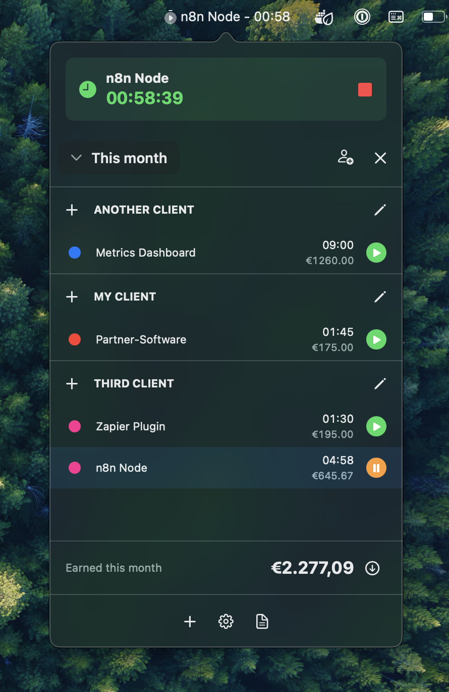

# PULSE - Productivity Utility Local Storage Engine



A privacy-first macOS time tracking application with enhanced features for manual time entry addition and webhook notifications.

## Features

### Core Features

- **Menu Bar Integration**: Lives quietly in your menu bar until you need it
- **Client/Project Tracking**: Organize your work by clients and projects
- **100% Local Operation**: All data stored locally on your Mac
- **Manual Time Entry**: Add and edit time entries after the fact
- **Earnings Tracking**: Set hourly rates and track earnings
- **Privacy-First**: No cloud sync, no telemetry, complete data control

### Enhanced Features

- **Webhook Notifications**: Optional outbound notifications to external systems. For example create invoices for last month with n8n.
- **Secure Delivery**: HTTPS-only webhooks with HMAC signatures
- **Retry Logic**: Automatic retry with exponential backoff
- **User Control**: Webhooks are completely optional and user-configured

## Architecture

This application follows a local-first architecture. It uses SwiftUI for the UI and Core Data for the data storage.

## Requirements

- macOS 12.0+ (Monterey)
- Xcode 14.0+
- Swift 5.7+

## Installation

### Development Setup

1. Clone the repository:

```bash
git clone <repository-url>
cd timetracker
```

2. Open the project in Xcode:

```bash
open EnhancedTimeTracker.xcodeproj
```

3. Build and run the project (⌘+R)

### Distribution

The app is currently not really distributed, since it is a personal project. You can download the latest release from the [Releases](https://github.com/eweren/pulse/releases) page.

## Usage

### Getting Started

1. **Launch the App**: The app runs from the menu bar - look for the clock icon
2. **Add Clients**: Go to Settings → Clients to add your clients
3. **Add Projects**: Go to Settings → Projects to add projects for each client
4. **Start Tracking**: Click the menu bar icon to start/stop timers

### Manual Time Entry

1. Click the menu bar icon
2. Select "Add Time Entry"
3. Choose client and project
4. Enter description and time range
5. Save the entry

### Webhook Configuration

1. Go to Settings → Webhooks
2. Click "Add Webhook"
3. Configure:
   - **Name**: Descriptive name for the webhook
   - **URL**: HTTPS endpoint to receive notifications
   - **Secret**: Optional HMAC secret for security
   - **Events**: Select which events to send
   - **Retry Settings**: Configure retry attempts and timeout

### Webhook Events

The app sends the following events:

    - time_entry_created (when a new time entry is created)
    - time_entry_updated (when a time entry is modified)
    - time_entry_deleted (when a time entry is deleted)
    - time_entry_started (when a timer is started)
    - time_entry_stopped (when a timer is stopped)
    - project_created (when a new project is created)
    - project_updated (when a project is modified)
    - client_created (when a new client is created)
    - client_updated (when a client is modified)
    - on_invoice_created (when a invoice-creation is triggered)

### Webhook Payload Example

```json
{
  "event": "time_entry_created",
  "timestamp": "2024-01-15T10:30:00Z",
  "signature": "sha256=abc123...",
  "data": {
    "id": "entry_123",
    "clientId": "client_456",
    "projectId": "project_789",
    "description": "Working on feature X",
    "startTime": "2024-01-15T09:00:00Z",
    "endTime": "2024-01-15T10:30:00Z",
    "duration": 90,
    "isManual": false
  }
}
```

## Privacy & Security

### Data Protection

- **100% Local Storage**: All data stored locally on your Mac
- **No Cloud Sync**: No cloud synchronization whatsoever
- **No Telemetry**: No usage tracking or analytics
- **User Control**: Complete control over data and webhook configuration

### Webhook Security

- **HTTPS Only**: Enforced for all webhook URLs
- **HMAC Signatures**: Request authenticity verification
- **User Choice**: Webhooks are completely optional
- **No Inbound**: App never receives external data

## Contributing

1. Fork the repository
2. Create a feature branch
3. Make your changes
4. Add tests if applicable
5. Submit a pull request

## License

This project is licensed under the MIT License - see the LICENSE file for details.

## Acknowledgments

- Inspired by [Daily Grind Time Tracker](https://apps.apple.com/de/app/daily-grind-time-tracker/id6748350033)
- Built with SwiftUI and Core Data
- Privacy-first design principles
- Build a lot with the help of Cursor. I reviewed most of the code, but don't guarantee that I overlooked some really bad code.
